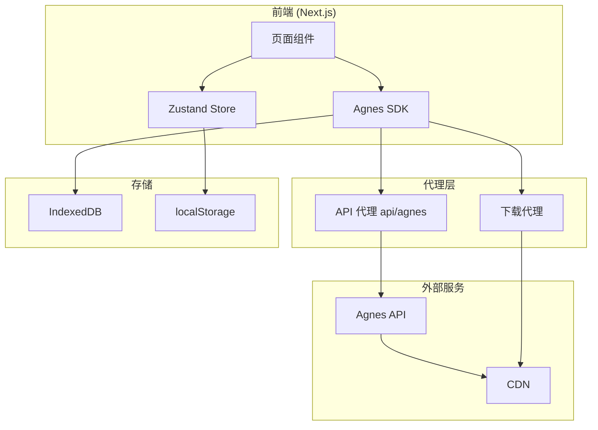
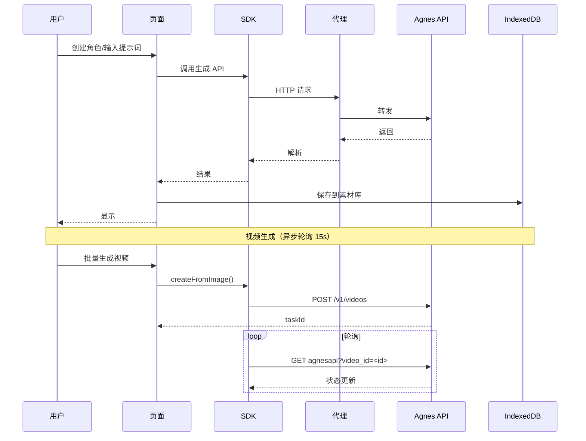
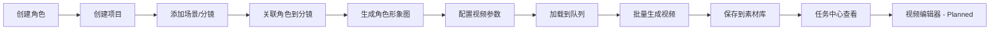

# Agnes AI Studio


🇨🇳 **简体中文**（当前） · 🇺🇸 [English](README_EN.md)

> AI 视频生产流水线 · 角色驱动 · 批量生成 · 全流程管理

## 目录
- [项目介绍](#1-项目介绍)
- [核心功能](#2-核心功能)
- [系统架构](#3-系统架构)
- [数据流](#4-数据流)
- [视频生产流程](#5-视频生产流程)
- [技术栈](#6-技术栈)
- [页面介绍](#7-页面介绍)
- [Agnes API 集成](#8-agnes-api-集成)
- [存储架构](#9-存储架构)
- [快速开始](#10-快速开始)
- [部署方式](#11-部署方式)
- [国际化](#12-国际化)
- [开发规范](#13-开发规范)
- [FAQ](#14-faq)
- [License](#15-license)

## 1. 项目介绍

**Agnes AI Studio** 是一个完整的 AI 视频生产流水线应用，提供从角色管理、项目创建、分镜设计到批量视频生成的全流程解决方案。

### 核心理念
- **角色一致性优先** — 通过角色库统一管理角色形象
- **图生视频为主** — 先生成角色图片再以图生视频方式生成视频
- **流水线式生产** — 批量生成、队列管理、任务监控

### 适用场景
- 短视频内容创作
- AI 故事视频制作
- 品牌营销视频批量生产

## 2. 核心功能
| 功能 | 路由 | 说明 |
|------|------|------|
| **角色库管理** | /characters | 创建/编辑角色，参考图上传 |
| **项目管理** | /projects | 场景和分镜管理，角色关联 |
| **生产流水线** | /pipeline | 角色图生成 → 批量视频→素材入库 |
| **文生图** | /generate-image | 文本生成图片，高级参数 |
| **图生图** | /image-to-image | 多图上传，同 Prompt 批量 |
| **图生视频** | /image-to-video | 图片参考，多 Prompt 批量 |
| **素材资源库** | /assets | 统一管理图片/视频 |
| **任务中心** | /history | 任务历史和状态 |
| **模型中心** | /models | AI 模型参数配置 |
| **提示词工作流** | /prompts | 提示词模板管理 |
| **恢复中心** | /recovery | 数据恢复和备份 |

## 3. 系统架构



## 4. 数据流



## 5. 视频生产流程



## 6. 技术栈
| 分类 | 技术 | 版本 |
|------|------|------|
| 框架 | Next.js | 15.2+ |
| 语言 | TypeScript | 5.7 |
| UI | React 19 + Tailwind CSS 3.4 | - |
| 组件 | shadcn/ui (Radix UI) | - |
| 状态管理 | Zustand 5 | - |
| HTTP | Axios 1.7 | - |
| 存储 | IndexedDB + localStorage | - |
| 拖拽 | @dnd-kit | 6.x |
| 图标 | Lucide React | 0.460 |
| 测试 | Vitest + Playwright | - |
| 构建 | Turbopack | - |

## 7. 页面介绍
| 路由 | 页面 | 说明 |
|------|------|------|
| / | 仪表盘 | 项目概览 |
| /characters | 角色库 | 创建和管理 AI 角色 |
| /projects | 项目管理 | 场景和分镜管理 |
| /pipeline | 生产流水线 | 核心生产流程 |
| /generate-image | 文生图 | 文本生成图片 |
| /image-to-image | 图生图 | 图片参考生成 |
| /image-to-video | 图生视频 | 多 Prompt 批量 |
| /assets | 素材资源库 | 统一管理资源 |
| /history | 任务中心 | 任务历史 |
| /models | 模型中心 | 模型参数配置 |
| /prompts | 提示词工作流 | 模板管理 |
| /recovery | 恢复中心 | 数据恢复 |
| /editor | 视频编辑器 | [Planned] |
| /settings | 设置 | API Key |

## 8. Agnes API 集成

SDK 位于 `src/services/agnes/`。所有请求通过 Next.js API 代理。

| 路由 | 目标 |
|------|------|
| /api/agnes/v1/text-to-image | apihub.agnes-ai.com/v1/text-to-image |
| /api/agnes/v1/videos | apihub.agnes-ai.com/v1/videos |
| /api/agnes/agnesapi | apihub.agnes-ai.com/agnesapi |
| /api/pipeline/download-image | 资源下载代理 |

**SDK 模块**: `index.ts`(入口), `client.ts`(HTTP), `image.ts`(图片), `video.ts`(视频+轮询), `types.ts`(类型)

**限流**: 创建 5s/次, 查询 12s/次, 429 退避 4x, 最大并发 3

## 9. 存储架构

**IndexedDB (AssetsDB)**: images(图片), videos(视频), thumbnails(缩略图), meta(元数据)
**Zustand Stores**: useProjectStore, useCharacterStore, useTaskStore, useUnifiedAssetStore, useProductionQueueStore
**CORS 处理**: CDN 不支持跨域，通过 `/api/pipeline/download-image` 代理下载

## 10. 快速开始

```bash
cd agnes-creator
npm install
npm run dev
# http://localhost:3000
```
然后访问 /settings 配置 API Key。

## 11. 部署方式
- **本地**: `npm run build` + `npm start`
- **Docker**: [Planned]
- **Vercel**: 开箱支持

## 12. 国际化

| 语言 | 代码 |
|------|------|
| 简体中文 | zh-CN |
| English | en-US |
文件: `src/i18n/`, hook: `useTranslation()`

## 13. 开发规范
1. **角色一致性优先**
2. **根因优先** — 禁止临时绕过
3. **流水线稳定性优先** — 角色>流水线>恢复>性能>功能
4. **国际化** — 所有 UI 中英文
5. 提交前 `npm run build`

## 14. FAQ
- **如何配置 API Key?** 在 /settings 页面
- **角色图片在哪?** 素材库和角色库
- **视频生成失败?** 检查 API Key/网络/429限流/任务中心
- **清理缓存?** `Remove-Item -Recurse -Force .next`

## 15. License
> [TODO] MIT License

<p align="center">
  <a href="README_EN.md">English</a> ·
  <a href="docs/ARCHITECTURE.md">架构</a> ·
  <a href="docs/API.md">API</a> ·
  <a href="docs/DEPLOYMENT.md">部署</a>
</p>
