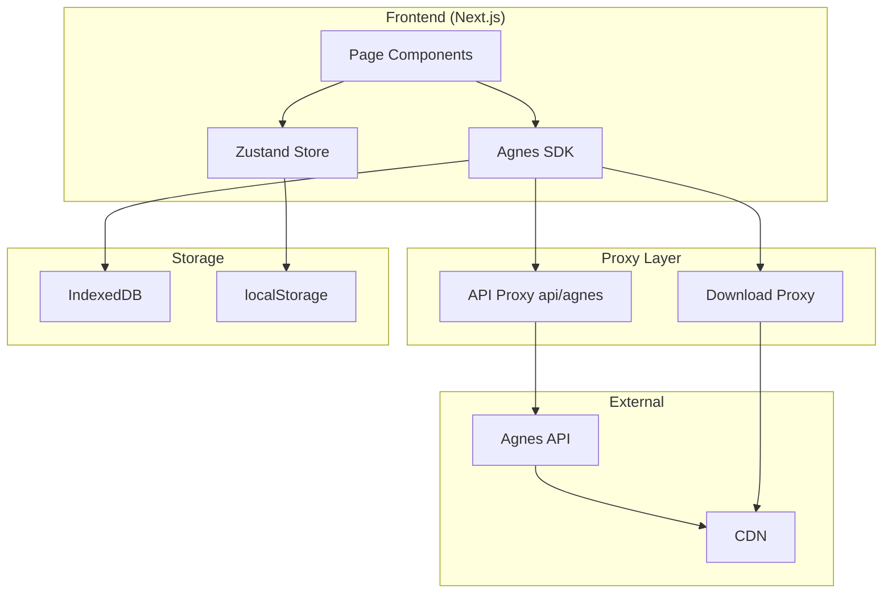
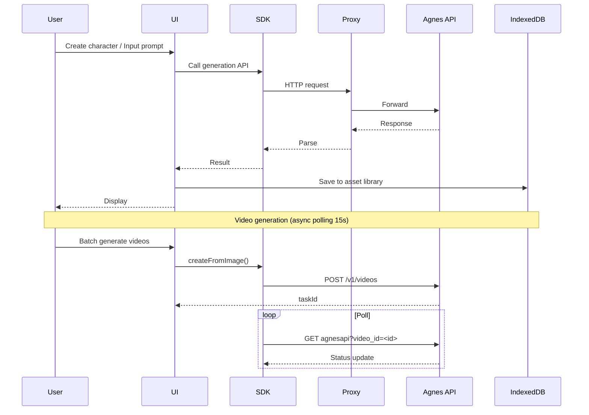

# Agnes AI Studio

?? **Language / ??**

- ???? **English** (current)
- ???? [????](README.md)

> AI Video Production Pipeline ? Character-Driven ? Batch Generation ? Full Workflow Management

---

## Table of Contents

- [Project Overview](#1-project-overview)
- [Features](#2-features)
- [System Architecture](#3-system-architecture)
- [Data Flow](#4-data-flow)
- [Video Production Pipeline](#5-video-production-pipeline)
- [Tech Stack](#6-tech-stack)
- [Pages](#7-pages)
- [Agnes API Integration](#8-agnes-api-integration)
- [Storage Architecture](#9-storage-architecture)
- [Quick Start](#10-quick-start)
- [Deployment](#11-deployment)
- [Internationalization](#12-internationalization)
- [Development Guide](#13-development-guide)
- [FAQ](#14-faq)
- [License](#15-license)

---

## 1. Project Overview

**Agnes AI Studio** is a complete AI video production pipeline application providing end-to-end workflow from character management, project creation, storyboard design to batch video generation.

### Core Philosophy

- **Character Consistency First** ? Unified character library ensures visual consistency
- **Image-to-Video Primary** ? Generate character images first, then use as references
- **Pipeline Production** ? Batch generation, queue management, task monitoring

### Use Cases

- Short video content creation
- AI story video production
- Brand marketing video batch production

---

## 2. Features

| Feature | Route | Description |
|---------|-------|-------------|
| **Character Library** | /characters | CRUD with reference images |
| **Project Management** | /projects | Scenes, shots, character assignment |
| **Production Pipeline** | /pipeline | Character images > batch videos > assets |
| **Text-to-Image** | /generate-image | Advanced params (seed/steps) |
| **Image-to-Image** | /image-to-image | Multi-upload, same prompt batch |
| **Image-to-Video** | /image-to-video | Multi-prompt batch from image |
| **Asset Library** | /assets | Unified image/video management |
| **Task Center** | /history | Task history and status |
| **Model Center** | /models | AI model configuration |
| **Prompt Workflow** | /prompts | Prompt template management |
| **Recovery Center** | /recovery | Data backup and recovery |

---

## 3. System Architecture



| Layer | Technology | Description |
|-------|------------|-------------|
| **Presentation** | Next.js App Router + React 19 | Pages and routing |
| **State** | Zustand 5 | Global state management |
| **Service** | Agnes SDK (Axios) | API encapsulation |
| **Proxy** | Next.js API Routes | CORS proxy |
| **Storage** | IndexedDB + localStorage | Persistence |

---

## 4. Data Flow



---

## 5. Video Production Pipeline

```mermaid
graph LR
    A[Create Character] --> B[Create Project]
    B --> C[Add Scenes/Shots]
    C --> D[Assign Characters]
    D --> E[Generate Character Images]
    E --> F[Configure Video Params]
    F --> G[Load to Queue]
    G --> H[Batch Generate Videos]
    H --> I[Save to Asset Library]
    I --> J[Task Center]
    J --> K[Video Editor - Planned]
```



---

## 6. Tech Stack

| Category | Technology | Version |
|----------|------------|---------|
| Framework | Next.js | 15.2+ |
| Language | TypeScript | 5.7 |
| UI | React 19 + Tailwind CSS 3.4 | -
| Components | shadcn/ui (Radix UI) | -
| State | Zustand 5 | -
| HTTP | Axios 1.7 | -
| Storage | IndexedDB + localStorage | -
| DnD | @dnd-kit | 6.x |
| Icons | Lucide React | 0.460 |
| Testing | Vitest + Playwright | -
| Build | Turbopack | -

---

## 7. Pages

| Route | Page | Description |
|-------|------|-------------|
| / | Dashboard | Overview and quick access |
| /characters | Character Library | Manage AI characters |
| /projects | Projects | Scenes and shots |
| /pipeline | Production Pipeline | Core workflow |
| /generate-image | Text-to-Image | Image generation |
| /image-to-image | Image-to-Image | Multi-image batch |
| /image-to-video | Image-to-Video | Multi-prompt batch |
| /assets | Asset Library | Resource management |
| /history | Task Center | Task history |
| /models | Model Center | Model config |
| /prompts | Prompt Workflow | Template management |
| /recovery | Recovery Center | Backup and recovery |
| /editor | Video Editor | Video editing [Planned] |
| /settings | Settings | API Key config |

---

## 8. Agnes API Integration

The SDK is at `src/services/agnes/`. All requests go through Next.js API proxy.

### Proxy Routes

| Route | Target |
|-------|--------|
| /api/agnes/v1/text-to-image | apihub.agnes-ai.com/v1/text-to-image |
| /api/agnes/v1/videos | apihub.agnes-ai.com/v1/videos |
| /api/agnes/agnesapi | apihub.agnes-ai.com/agnesapi |
| /api/pipeline/download-image | Resource download proxy |

### SDK Modules

| Module | Description |
|--------|-------------|
| `index.ts` | SDK entry, image/video services |
| `client.ts` | Axios HTTP client |
| `image.ts` | Text-to-image, image-to-image |
| `video.ts` | Video generation + polling + rate limit |
| `types.ts` | TypeScript definitions |

### Rate Limiting

| Type | Limit |
|------|-------|
| Create requests | 1 per 5s |
| Poll queries | 1 per 12s |
| 429 handling | 4x exponential backoff |
| Max concurrency | 3 |

---

## 9. Storage Architecture

### IndexedDB (AssetsDB)

Stores binary assets (images, videos, thumbnails).

| Object Store | Description | Indexes |
|--------------|-------------|--------|
| images | Image assets | type, projectId, characterId |
| videos | Video assets | type, projectId |
| thumbnails | Thumbnails | assetId |
| meta | Metadata | -

### Zustand Stores

| Store | Description |
|-------|-------------|
| useProjectStore | Project and shot data |
| useCharacterStore | Character data |
| useTaskStore | Task queue |
| useUnifiedAssetStore | Asset library interface |
| useProductionQueueStore | Production queue |

### CORS Handling

CDN (platform-outputs.agnes-ai.space) has no CORS support. All downloads use server proxy `/api/pipeline/download-image`.

---

## 10. Quick Start

### Prerequisites

- Node.js 20+
- npm 10+
- Agnes API Key

### Install

```bash
cd agnes-creator
npm install
```

### Run

```bash
npm run dev
# Open http://localhost:3000
```

### Configure

Visit /settings page, enter API Key.

---

## 11. Deployment

### Local
```bash
npm run build
npm start
```

### Docker [Planned]

Dockerfile to be added.

### Vercel

Supports out-of-the-box deployment.

---

## 12. Internationalization

Supports Chinese/English toggle (Chinese default).

| Language | Code |
|----------|------|
| Simplified Chinese | zh-CN |
| English | en-US |

Files in `src/i18n/`, use `useTranslation()` hook.

---

## 13. Development Guide

1. **Character Consistency First**
2. **Root Cause First** ? No workarounds
3. **Pipeline Stability First** ? Character > Pipeline > Recovery > Performance > Features
4. **Internationalization** ? All UI in CN/EN
5. Run `npm run build` before committing

### Directory Structure

```
agnes-creator/src/
??? app/          # Pages + API routes
??? components/   # UI components
??? hooks/        # Custom Hooks
??? i18n/         # Internationalization
??? lib/          # Utilities
??? services/     # Biz logic + Agnes SDK
??? stores/       # Zustand stores
??? types/        # Type definitions
```

---

## 14. FAQ

**Q: How to configure API Key?**

Visit /settings page.

**Q: Where to find character images?**

In Asset Library and Character Library.

**Q: Video generation failed?**

Check: API Key, network, 429 rate limit, task center details.

**Q: How to clear cache?**

```bash
Remove-Item -Recurse -Force .next
```

---

## 15. License

> [TODO] MIT License

---

<p align="center">
  <a href="README.md">???? ????</a> ?
  <a href="docs/ARCHITECTURE.md">Architecture</a> ?
  <a href="docs/API.md">API</a> ?
  <a href="docs/DEPLOYMENT.md">Deployment</a> ?
  <a href="docs/CONTRIBUTING.md">Contributing</a>
</p>
