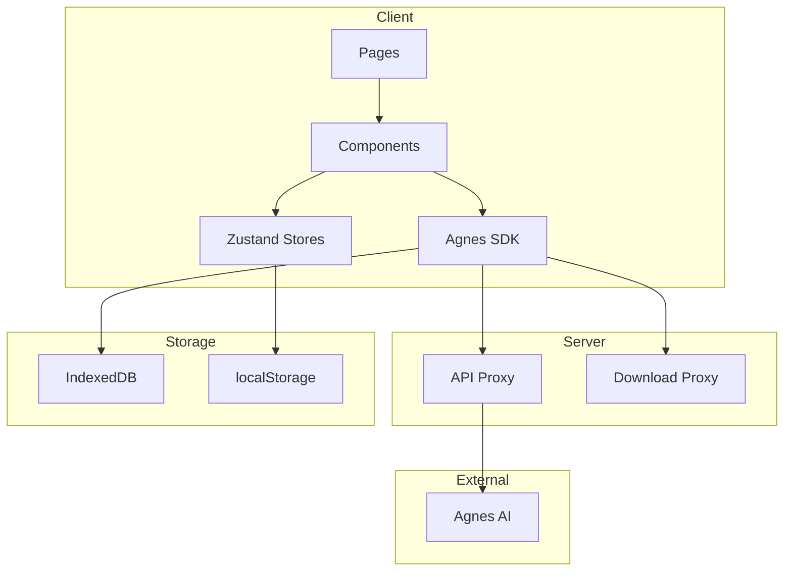

# 架构文档

> [English](ARCHITECTURE_EN.md) · [API](API.md) · [部署](DEPLOYMENT.md)

## 系统概述
Agnes AI Studio 采用分层架构：
- **表示层**: Next.js App Router 页面 + React 组件
- **状态层**: Zustand 存储 (localStorage 持久化)
- **服务层**: Agnes SDK (Axios 客户端)
- **代理层**: Next.js API 路由 (转发至 Agnes API)
- **存储层**: IndexedDB (二进制资源) + localStorage (配置)

## 架构图


## 目录结构
```
src/
├── app/             # 页面和 API 路由
├── components/      # UI 组件
├── hooks/           # 自定义 Hooks
├── i18n/            # 国际化
├── lib/             # 工具函数
├── services/agnes/  # Agnes SDK
├── stores/          # Zustand 状态
└── types/           # 类型定义
```

## SDK 架构
```
src/services/agnes/
├── index.ts   # 单例，暴露 image/video
├── client.ts  # Axios HTTP 客户端
├── image.ts   # 图片生成
├── video.ts   # 视频生成 + 轮询 + 限流
└── types.ts   # TypeScript 类型
```

## 限流机制
- 创建请求: 最少间隔 5 秒
- 状态查询: 最少间隔 12 秒, 20 秒窗口内最多 3 次
- 429 错误: 当前间隔 x4 退避
- 超时: 10 分钟, 连续错误上限 20 次

## CORS 策略
CDN 不支持跨域。所有下载通过 `/api/pipeline/download-image` 代理。

## 错误分类
| 类型 | 策略 |
|------|------|
| 网络错误 | 自动重试 |
| 429 限流 | 指数退避 x4 |
| 401 认证 | 显示配置警告 |
| 5xx 服务错误 | 退避重试 |
| CORS 错误 | 服务端代理 |
