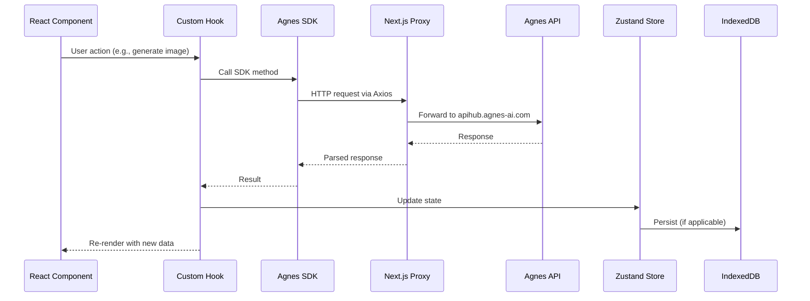

# Architecture Documentation

## System Overview

Agnes AI Studio uses a layered architecture with clear separation of concerns:

- **Presentation Layer**: Next.js App Router pages with React components
- **State Layer**: Zustand stores (persisted to localStorage or in-memory)
- **Service Layer**: Agnes SDK (Axios-based API client)
- **Proxy Layer**: Next.js API routes for forwarding requests to Agnes API
- **Storage Layer**: IndexedDB for binary assets, localStorage for config

## Directory Layout

```
src/
??? app/           # Pages & API routes
??? components/    # Reusable UI components
??? hooks/         # Custom React hooks
??? i18n/          # Internationalization
??? lib/           # Utility functions
??? services/      # Business logic & API clients
??? stores/        # Zustand state stores
??? types/         # TypeScript type definitions
```

## Agnes SDK Architecture

```
src/services/agnes/
??? index.ts      # Singleton: agnes.image, agnes.video
??? client.ts     # Axios HTTP client with interceptors
??? image.ts      # Image generation (text + image-to-image)
??? video.ts      # Video generation (text + image-to-image + polling)
??? types.ts      # TypeScript definitions
```

The SDK singleton is created at module load time:

```typescript
export const agnes = (() => {
  const client = createClient();
  const image = createImageService(client);
  const video = createVideoService(client);
  return { image, video, getConfig, configure };
})();
```

## Data Flow Pattern



## Video Generation Polling

The video service implements a polling loop for async video generation:

1. Call POST /v1/videos ? get taskId
2. Poll GET /agnesapi?video_id=<taskId> every 15s
3. Exponential backoff on rate limit (4x) or no-progress (2x)
4. Max interval: 60s, timeout: 10min, consecutive error limit: 20

## Error Classification

Errors are categorized by `errorClassifier.ts` for structured handling:

- Network errors ? retry
- 429 Rate Limit ? backoff
- 401 Auth ? show config warning
- Content policy violation ? show API message
- 5xx Server Error ? retry with backoff
- CORS ? use server proxy
