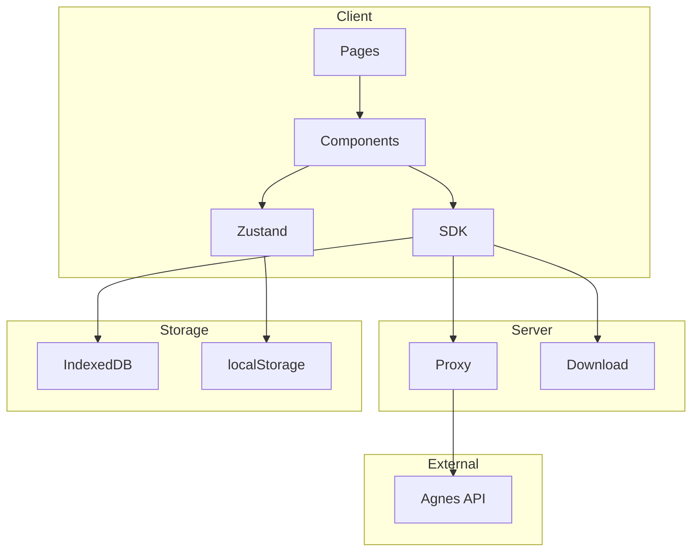

# Architecture Documentation

> [中文](ARCHITECTURE.md) · [API](API_EN.md) · [Deployment](DEPLOYMENT_EN.md)

## Overview
Layered architecture: Presentation (Next.js), State (Zustand), Service (Agnes SDK), Proxy (Next.js API), Storage (IndexedDB + localStorage)

## Diagram

## Rate Limiting
- Create: min 5s interval
- Query: min 12s, max 3 per 20s
- 429: 4x backoff
- Timeout: 10 min, max 20 errors

## CORS
CDN has no CORS. Download via `/api/pipeline/download-image` proxy.

## Errors
| Type | Strategy |
|------|----------|
| Network | Auto retry |
| 429 | 4x backoff |
| 401 | Config warning |
| 5xx | Backoff retry |
| CORS | Server proxy |
